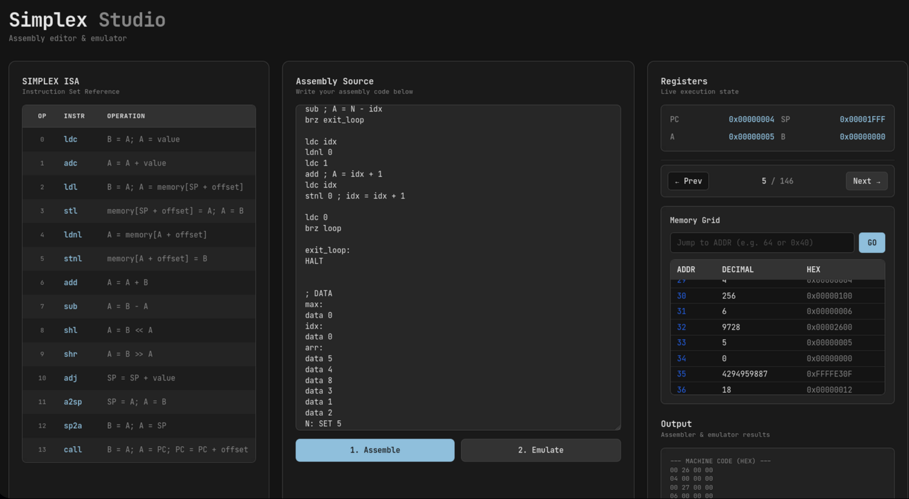
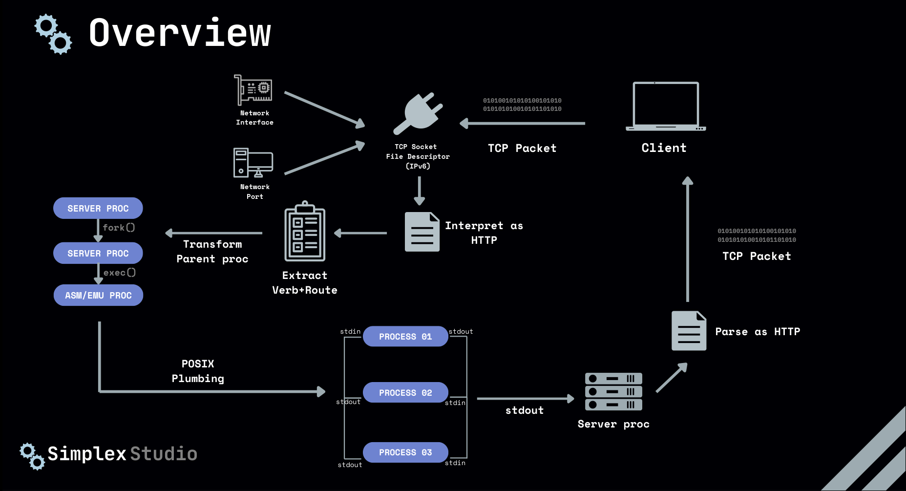

# Simplex Studio

This project contains 3 main components at its core:
- Assembler + Emulator written in C99 
- A POSIX-Compliant Web Server written in POSIX C to expose the functionality of the binaries over a REST API 
- A React Web App written in JavaScript for interacting with the Web Server to better visualize traces 




## Assembler + Emulator

- All the code pertaining to the assembler and emulator is present in the assembler/ folder
- The Assembler and Emulator each make use of multiple files for the sake of modularity and clean code architecture,
  thus, a Makefile is provided to compile it appropriately
- Directory structure:
    - build/target/ contains the binaries built by the Makefile, i.e, the required asm and emu binaries
    - include/ contains headers used by the assembler (assembler.h) and emulator (emulator.h)
    - tests/ contains a folder for each test case, which has the appropriate .asm file, .obj file, .lst file and .log file
    - src/ contains the core programs required for the functionality of the assembler and emulator
        - asm.c : the entrypoint of the assembler
        - assembler_utils/format.c : utilities for printing internal representations
        - assembler_utils/instr.c : the defined SIMPLEX instruction set and a utility to lookup instructions by mnemonic
        - assembler_utils/pass1.c : the core logic for executing the first pass of the assembler to construct a meaningful internal representation
        - assembler_utils/pass2.c : the core logic for executing the second pass of the assembler and writing to appropriate files
        - assembler_utils/symbol.c : utilities for symbol lookup by label and setting a symbol as used
        - emu.c : the entrypoint for the emulator
        - emulator_utils/memory.c : utilities to initialise memory and print it in a human readable form or as a json string
        - emulator_utils/run.c : the core logic to run the assembled binary in accordance with the SIMPLEX ISA
    - Makefile for automating the build and testing processes

- To build the project, run (from the root of assembler/ where the Makefile is present)
      ```make asm emu```
  This will build the asm and emu binaries in build/target/asm and build/target/emu

- To automatically run the tests in tests/, run (from the root of assembler/ where the Makefile is present)
      ```make test```
  This will assemble the asm files present in each folder in tests/ and generate the corresponding .obj, .lst and .log files in their respective folders

### Assembler
  - The assembler is capable of running in 2 modes: standard mode and i/o mode
  - Standard Mode:
        - Expected to be run as: ```./asm input.asm output.obj output.lst```
        (or rather ``./build/target/asm input.asm output.obj output.lst``)
        - This assembles the input.asm file and creates the output.obj file (binary machine code) and output.lst file (listing file with memory dump)
        - It also writes intermediate representations and errors/warnings to stdout and stderr (can be redirected to a .log file as done in the Makefile)
        - All the tests in tests/ have been processed through Standard Mode, and the corresponding outputs are in the respective folders
        - The assigned example programs are assembled as expected
        - To redirect logs to a log file:
                ```./build/target/asm input.asm output.obj output.lst > out.log 2>&1```
  - I/O mode:
        - Expected to be run as : ```<some_program> | ./asm -i | <some_other_program>```
        (or rather ``<some_program> | ./build/target/asm -i | <some_other_program>``)
        E.g: ``echo "ldc 5 \n HALT" | ./asm -i | xxd``
        - This mode reads the program to be assembled from stdin and writes the assembled binary to stdout
        - For e.g, here ``<some_program>`` can write assembly code to its stdout, which is read from asm's stdin, once assembled, the machine code bytes are sent to stdout, read by ``<some_other_program>``'s stdin
        - This was implemented to be used by the POSIX Web Server (other component) as 
              1. It can directly assemble programs in memory without requiring any writes to disk
              2. Redirection from stdin and stdout streams makes it easier to work with POSIX Pipes so that the web server process can communicate with the assembler process (for the sake of IPC)
  - Capabilities:
        - Every instruction and pseudo-instruction is compatible with the assembler (including HALT, SET and data)
        - The listing file shows the bytes produced for each instruction and that instruction's mnemonic at no extra I/O cost
        - The first pass reads every line of the assembly code, cleans comments, saves symbols/labels to a symbol table, and recognizes mnemonics and operands, building a complete internal representation of the code (thus, not requiring any I/O with the input file in the second pass)
        - The second pass uses this internal representation to correctly assign addresses to labels, and correctly translates mnemonics and appropriate opcodes into machine code and a listing file
        - The assembler issues warnings for unused labels, missing HALT and errors for:
            - Invalid Label Name
            - Illegal Immediate
            - Extra on end of line
            - Duplicate label
            - Unknown Instruction
            - Unexpected operand
            - Expected an operand
            - Symbol not found

### Emulator
  - The emulator is capable of running in 2 modes: standard/regular mode and json mode
  - Standard Mode:
        - Expected to be run as: ```./emu output.obj```
        (or rather ``./build/target/emu output.obj``)
        - This emulates the SIMPLEX machine code in output.obj and writes the step by step state of registers PC,SP,A,B, along with the operand and opcode of each instruction to stdout
        -
  - JSON Mode:
        - Expected to be run as : ```<some_program> | ./emu -j | <some_other_program>```
        (or rather ``<some_program> | ./build/target/emu -j | <some_other_program>``)
        E.g: ``cat output.obj | ./emu -j``
        - This mode reads the binary to be emulated from stdin and writes the step by step register state and trace as a json string to stdout
        - For e.g, here ``<some_program>`` can write SIMPLEX ISA binary instructions to its stdout, which is read from emu's stdin, once emulated, the json string is sent to stdout, read by ``<some_other_program>``'s stdin
        - This was implemented to be used by the POSIX Web Server (other component) as 
              1. It can directly emulate programs in memory without requiring any writes to disk
              2. Redirection from stdin and stdout streams makes it easier to work with POSIX Pipes so that the web server process can communicate with the emulator process (for the sake of IPC)
  - Capabilities:
        - Capable of emulating all 18 instructions of the SIMPLEX ISA
        - Issues errors for invalid opcodes and potential infinite loops
        - A program is assumed to have run into an infinite loop if it executes over a very large number of CPU cycles (here, 100,000)
        - Step by step register state and final memory trace is sufficient to track "trace, read, write, before, after" as present in the original emu

## POSIX-Compliant Web Server in C

- All the code pertaining to the web server is present in the web_server/ folder
- The web server makes use of multiple files for the sake of modularity and clean code architecture,
  thus, a Makefile is provided to compile it appropriately
- Directory structure:
    - build/target/ contains the binaries built by the Makefile, i.e, the server binary
    - include/ contains headers used by the server (server.h)
    - src/ contains the core programs required for the functionality of the server 
        - main.c : the entry point for the server
        - router.c : the logic for routing requests for /assemble and /emulate
        - assemble.c : for interfacing with the assembler binary via POSIX Pipes
        - emulate.c : for interfacing with the emulator binary via POSIX Pipes
    - Makefile for automating the build process

- To build the project, run (from the root of web_server/ where the Makefile is present)
      make server 
  This will build the server binary in build/target/server
- The server can be started by running:
      ``./server``
      (or rather ``./build/target/server``)
- The server requires to be run in a POSIX-Compliant environment, such as on a Linux Distribtion (Bare metal, Docker environment or WSL), BSD or any other POSIX Compliant Operating System (Windows doesn't adhere by default)
- This is required as the server makes use of POSIX sockets, POSIX pipes and certain syscalls only available on these standards
- A Dockerfile is provided at the root of the project for running in a non-POSIX compliant environment with Docker available (uses an Ubuntu base)
- For running through Docker:
      ```docker build . -t simplex-server
      docker run -p 8080:8080 -it simplex-server```
- Capabilities:
        - The server initialises a TCP server via sockets and binds it to port 8080
        - It accepts TCP packets and stores it into a constant size buffer of 10kb in memory
        - This buffer is parsed to extract the HTTP Verb and HTTP Route for the given request
        - POST and OPTIONS verbs are supported and the verb+route is handled accordingly by the router
        - Available routes are POST /assemble and POST /emulate, and their corresponding OPTIONS routes to accept foreign requests
        - For running the asm or emu binaries in the server, the fork syscall is used to fork the current process and transform the child process into one running the appropriate binary via the execl syscall
        - Appropriate read and write pipes are setup with the child process for the stdin, stdout and stderr streams
        - Requests parsed by the server are sent to the asm and emu binary's stdin. The binary's stdout is read from the parent process via a pipe.
        - Depending on the state of execution of the child process (successful or with errors), an HTTP 200 OK or HTTP 400 Bad Request is generated
        - The corresponding HTTP payload is sent back to the caller via the socket, along with either the assembled machine code, emulator trace or error

## React Web App

- All the code pertaining to the web app is present in the studio/ folder
- Certain files in this folder may not contain a declaration of authorship as they are files from third party dependencies or autogenerated files by tools such as npm, npx for correctly bootstrapping third party tools
- The core logic of the web app essential for its proper functioning contains declaration of authorship and is solely written by me.
- Directory structure:
    - node_modules/ : third party dependencies of the project
    - src/ : Core source code for the web app
        - main.jsx : Entrypoint for the React Web App
        - index.css : Root CSS file for styling the web app
        - App.jsx : The single page of the app, describing the component structure and layout of the app, as well as interfacing with the web server
        - components/CodeEditor.jsx : The text area where assembly code is written on the app
        - components/DebugControls.jsx : Panel for stepping through emulator stages along with memory inspector
        - components/MemoryInspector.jsx : List of memory addresses and their values, with functionality to search for an address by deicmal or hex
        - components/OutputBox.jsx : Text box for showing machine code dump and other status messages
        - components/RegisterDisplay.jsx : Panel for showing state of registers PC,SP,A,B at each step of the emulator
        - lib/utils.js : (generated) utility file for tailwind css merge
    - index.html : Entrypoint for the web page
    - server.js : Entrypoint for serving the built site
    - package.json : (generated) for tracking node dependencies
    - package-lock.json : (generated) for tracking node dependencies
    - postcss.config.js : (generated) for setting up tailwind css as a postcss plugin
    - tailwind.config.js : (generated) tailwind css configuration
    - vite.config.js : (generate) vite configured to build react apps
- Install dependencies using: (at the root of studio/)
      ``` npm install ```
- The web app can be run in Dev mode using: (at the root of studio/)
      ``` npm run dev ```
- Capabilities:
        - The web app is accessible on http://localhost:5173 . It assumes that the web server is up and running on http://localhost:8080
        - The app features a code editor where SIMPLEX assembly can be written 
        - This code can be assembled, which internally calls POST /assemble
        - The machine code received can be emulated, which internally calls POST /emulate
        - Register state can be observed step by step and final memory addresses can be inspected
